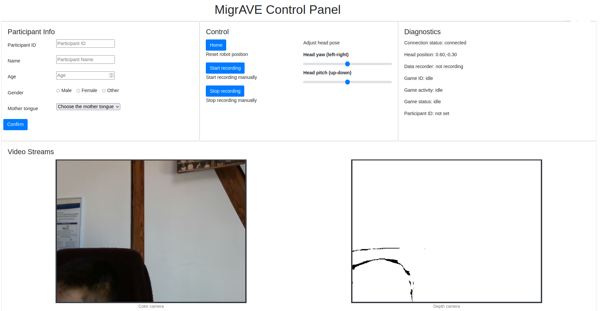

# migrave web console
Repository of web console for the MigrAVE project

## Dependences

- web_video_server
- rosbridge_suite
- realsense-ros
- migrave_ros_msgs
- migrave_games

## Usage

1. Launch the rosbridge node
    ```sh
    roslaunch migrave_web_console qt_rosbridge_websocket.launch
    ```
    Currently, rosbridge started automatically in the QTrobot. 

2. Open the `index.html` file with the browser. 

## Screenshot

This is how the web console looks like.


## Project Structure
```
├── CMakeLists.txt
├── LICENSE
├── README.md
├── package.xml
├── ros
│   ├── launch
│   │   ├── migrave_video_recorder.launch
│   │   ├── rs_camera.launch
│   │   └── usb_cam_both.launch
│   ├── scripts
│   │   ├── migrave_video_recorder
│   │   └── migrave_webcam_recorder
│   └── src
│       └── video_recorder
│           ├── __init__.py
│           └── video_recorder.py
└── setup.py
```
